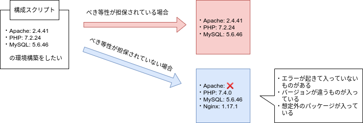

# Ansibleによる構成管理

## べき等性

べき等性とは、そのスクリプトを一回実行した結果と複数回実行した結果が変わらないことを示す

関数で言うところの参照透過性、副作用のない関数とほぼ同等の意味合いと考えて良い

構成管理においても、このべき等性が担保されていることが重要である

同じスクリプトを実行して、違う環境が構成されてしまっては構成管理ツールの意味がなくなってしまうからである



べき等性を担保するためには以下の点を意識してスクリプトを書くことが望ましい

- インストールするパッケージのバージョンを指定する
- スクリプトが実行された環境の情報を取得し、差分を処理する

***

## Ansibleインストール

Ansibleはローカルマシンにインストールする必要がある

ここでは、Windows 10 環境と Ubuntu 18.04 環境におけるインストール方法を公開する

### Ansibleインストール on Windows 10
ここでは、Windows Subsystem Linux（WSL）を使うことにする

`Win + X` |> `A` => 管理者権限でPowerShell起動

```powershell
# Windows Subsystem Linux を有効化する
> Enable-WindowsOptionalFeature -Online -FeatureName Microsoft-Windows-Subsystem-Linux
この操作を完了するために、今すぐコンピューターを再起動しますか?
[Y] Yes  [N] No  [?] ヘルプ (既定値は "Y"): # そのままENTERして再起動

# 再起動したら Ubuntu 18.04 ディストロパッケージをダウンロード
## 「ダウンロード」ディレクトリに ubuntu1804.appx というファイル名でダウンロード
> Invoke-WebRequest -Uri https://aka.ms/wsl-ubuntu-1804 -OutFile ~\Downloads\ubuntu1804.appx -UseBasicParsing

# ダウンロードしたディストロパッケージをWSLに追加
> Add-AppxPackage ~\Downloads\ubuntu1804.appx
```

スタートメニューに「Ubuntu 18.04」が追加されるため、起動する

```bash
# 初回起動時は初期設定が必要
Installing, this may take a few minutes...
Please create a default UNIX user account. The username does not need to match your Windows username.
For more information visit: https://aka.ms/wslusers
Enter new UNIX username: # ログインユーザ名を設定
Enter new UNIX password: # ログインパスワードを設定
Retype new UNIX password: # パスワードをもう一度入力
```

以降は **Ansibleインストール on Ubuntu 18.04** の項を参照

### Ansibleインストール on Ubuntu 18.04
```bash
# Ansibleインストール用のリポジトリ追加
$ sudo apt update && apt install software-properties-common
$ sudo apt-add-repository --yes --update ppa:ansible/ansible

# Ansibleインストール
$ sudo apt install ansible

# バージョン確認
$ ansible --version
ansible 2.9.1
```

***

## Ansibleを使ってみる

### インベントリファイルの作成
Ansibleの接続先サーバ情報等を記述した設定ファイルを**インベントリファイル**と呼ぶ

インベントリファイル名は任意だが、ここでは `servers.yml` というファイル名にする

なお、インベントリファイルの形式としては**ini形式**と**yaml形式**があるが、ここではyaml形式を採用する

`servers.yml` にサーバ情報を以下の通り記述する（yaml形式ではインデントにも意味があるため、インデント幅に注意すること）

```yaml
all:
  hosts: # ホスト定義
    conoha-vps: # conoha-vps host
      ansible_host: XXX.XX.XX.XX # 指定サーバのIPアドレス
  vars:  # 変数定義（接続設定）
    ansible_ssh_port: 22 # SSH接続ポートは通常 22番
    ansible_ssh_user: root # SSH接続ユーザ名
    ansible_ssh_pass: password # SSH接続パスワード
    ansible_sudo_pass: password # rootユーザパスワード
```

意味としては以下のようになる

- hosts設定:
    - サーバIPアドレス `XXX.XX.XX.XX` を `conoha-vps` というエイリアス名に設定
        - ※ `XXX.XX.XX.XX` は接続先サーバの IPv4 アドレスを指定すること
- vars設定: ここではSSH接続情報を記述
    - ansible_ssh_port: SSH接続ポート｜基本的に`22`を指定
    - ansible_ssh_user: SSH接続ユーザ｜ここでは`root`を設定
    - ansible_ssh_pass: SSH接続パスワード
    - ansible_sudo_pass: rootユーザパスワード｜rootユーザでSSH接続する場合は ansible_ssh_pass と同一になる

### 単一コマンドの実行
インベントリファイルを作成したら、Ansibleでサーバ内のコマンドを実行させてみる

`servers.yml` があるディレクトリ内で以下のコマンドを実行

```bash
# Ansibleでサーバ内に接続し hostname コマンドを実行
## ansible <エイリアス名>: エイリアス名に設定されたサーバに接続する
## -i <インベントリファイル>: インベントリファイルを指定
## -m <モジュール名>: Ansibleの実行モジュールを指定（ここでは command を指定）
## -a <引数>: Ansible実行モジュールの引数を指定
### => 今回は command モジュールのため hostname コマンドを実行するという意味になる
$ ansible conoha-vps -i servers.yml -m command -a "hostname" 

## => XXX-XX-XX-XX
### サーバのIPアドレスが返ってきたら成功
```
