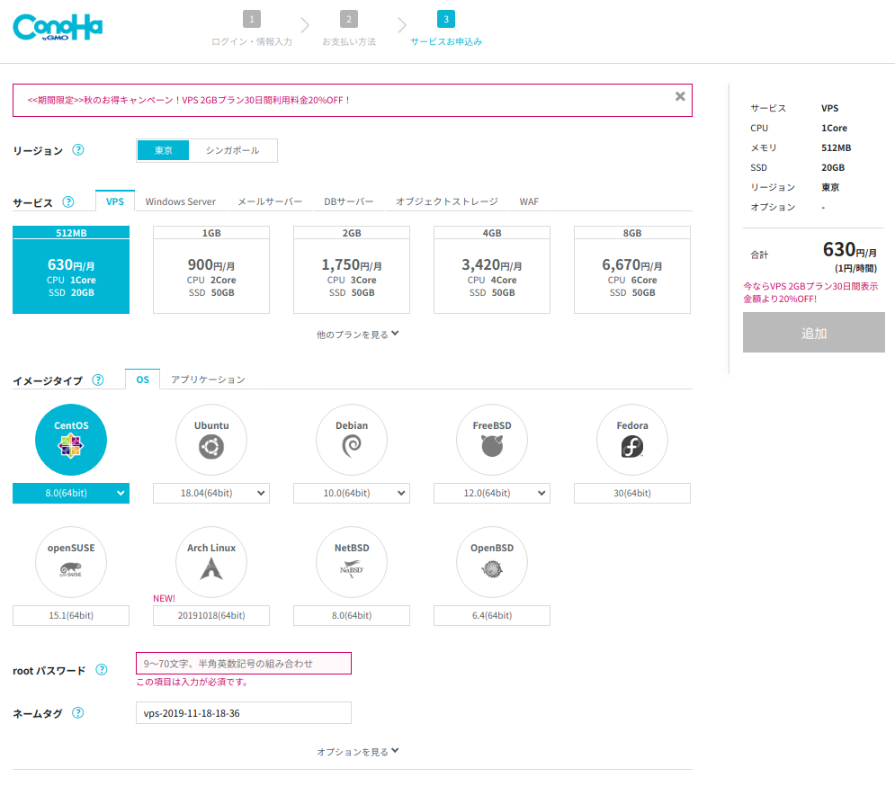
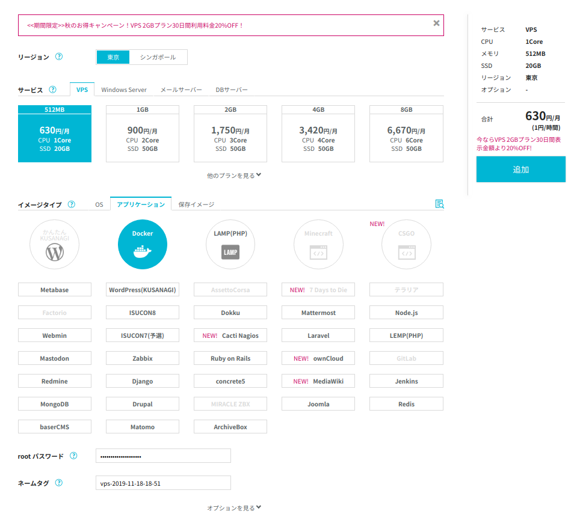

# ConoHa VPS

## 申し込み

- ConoHaユーザからの紹介リンクを踏んで申し込むと1000円のクーポンがあるらしい
    - 今回は見送り
- [新規登録](https://www.conoha.jp/conoha/signup)から申し込みを行う
    - 氏名、住所等の基本情報を入力
    - 電話番号認証が必要（今回は自分の携帯電話でSMS認証を実行）
    - VPSの場合 512MB〜8GB プランがあり、プランとOS、アプリケーション等を選択して申し込む
        - ※ 512MBプランでは、選べるアプリケーションに制限がある
        - ※ 512MBプランでは、スケールアップ・ダウンができない（512MBプランしか使えない）
        - 今回は学習目的のため 512MBプラン, CentOS8, アプリケーションなし を申し込み

