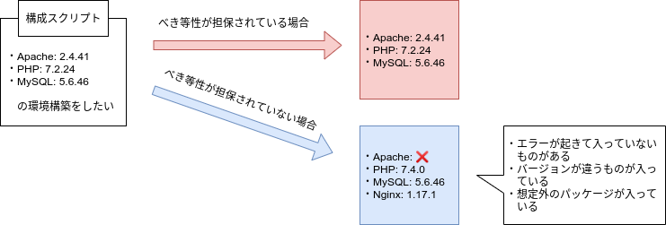

# Ansible｜サーバ構築テンプレート作成

## Ansibleによる構成管理

### べき等性
べき等性とは、そのスクリプトを一回実行した結果と複数回実行した結果が変わらないことを示す

関数で言うところの参照透過性、副作用のない関数とほぼ同等の意味合いと考えて良い

構成管理においても、このべき等性が担保されていることが重要である

同じスクリプトを実行して、違う環境が構成されてしまっては構成管理ツールの意味がなくなってしまうからである



べき等性を担保するためには以下の点を意識してスクリプトを書くことが望ましい

- インストールするパッケージのバージョンを指定する
- スクリプトが実行された環境の情報を取得し、差分を処理する

---

### Ansibleのインストール
Read [ansible-installation.md](./ansible-installation.md).

---

### Vagrant仮想サーバを用いたAnsible動作確認
Read [vagrant/README.md](./vagrant/README.md).

***

## サーバ構築のテンプレート作成

Ansibleを用いて、割とよく使うサーバ構成をテンプレート化する

Read [server/README.md](./server/README.md).

***

## ConoHa VPS

### 申し込み
- ConoHaユーザからの紹介リンクを踏んで申し込むと1000円のクーポンがあるらしい
    - 今回は見送り
- [新規登録](https://www.conoha.jp/conoha/signup)から申し込みを行う
    - 氏名、住所等の基本情報を入力
    - 電話番号認証が必要（今回は自分の携帯電話でSMS認証を実行）
    - VPSの場合 512MB〜8GB プランがあり、プランとOS、アプリケーション等を選択して申し込む
        - ※ 512MBプランでは、選べるアプリケーションに制限がある
        - ※ 512MBプランでは、スケールアップ・ダウンができない（512MBプランしか使えない）


#### VPSサーバ追加
今回は学習目的のため 512MBプラン, CentOS8, アプリケーションなし を申し込むことにした

以下の画像の通り **rootパスワード** を設定し「追加」ボタンを押す（複数のサーバを申し込む場合は **ネームタグ** に分かりやすい名称をつけることを推奨）

サーバを追加した瞬間から課金が始まる（1時間単位）


---

### SSH接続確認
サーバを追加したらSSH接続できることを確認する

なお、Ansibleを使うにはSSH接続できることが前提となる

#### IPアドレスの確認
追加したサーバの接続IPアドレスを確認する

- サイドバー: サーバ > サーバリスト
    - 追加したサーバのネームタグをクリック
        - 【ネットワーク情報】 > タイプ: IPv4
            - IPアドレス: `XXX.XX.XX.XX` をメモ

#### SSH接続
ターミナル（or PowerShell）で以下のコマンドを実行し、SSHでサーバに接続できるか確認する

```bash
# XXX.XX.XX.XX は先程確認したIPアドレス
$ ssh root@XXX.XX.XX.XX
password: # <- サーバ追加時に設定したパスワードを入力してENTER

---

# 問題なくサーバに接続できたら exit でサーバから抜ける
[root@XXX-XX-XX-XX ~]% exit
```
